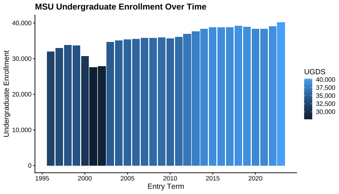

<!-- README.md is generated from README.Rmd. Please edit README.Rmd and knit rmarkdown::render("README.Rmd") -->

<!-- badges: start -->

[](https://www.repostatus.org/)
[](https://cran.r-project.org/package=MSUthemes)
[](https://github.com/emilioxavier/MSUthemes/actions/workflows/R-CMD-check.yml)
[](https://app.codecov.io/gh/emilioxavier/MSUthemes?branch=main)
[](CodeOfConduct.md)
[](https://creativecommons.org/licenses/by-sa/4.0/)
[](https://doi.org/10.5281/zenodo.17259014)
<!-- badges: end -->

# — \>\> MSUthemes \<\< — 

The {MSUthemes} package provides color palettes and themes for [Michigan
State University (MSU)](https://msu.edu/) and comprehensive color
support for all Big Ten Conference institutions. The package includes
MSU-specific palettes (sequential, diverging, and qualitative) designed
to align with MSU’s branding guidelines, as well as individual and
aggregate color palettes for all 18 Big Ten institutions, making it
ideal for multi-institutional comparisons and collaborative research
visualizations using {ggplot2}.

This package is inspired by the
[RSSthemes](https://github.com/nrennie/RSSthemes) package and based on
the work of [Andreas Krause](https://las.inf.ethz.ch/krausea), [Nicola
Rennie](https://nrennie.rbind.io/), and [Brian
Tarran](https://brtarran.github.io/). While the original
[RSSthemes](https://github.com/nrennie/RSSthemes) package focused on the
[Royal Statistical Society (RSS)](https://rss.org.uk/) branding, this
package adapts the concepts to fit MSU’s visual identity. The
{MSUthemes} package uses the
[RSSthemes](https://github.com/nrennie/RSSthemes) framework, replaces
the [RSS](https://rss.org.uk/) colour palettes with MSU colour palettes,
and adds comprehensive Big Ten Conference institutional colors with
reliable institution-to-color matching capabilities.

The authors of the [RSSthemes](https://github.com/nrennie/RSSthemes)
package have created an excellent website discussing the [‘Best
Practices for Data Visualisation’, published by the Royal Statistical
Society](https://github.com/royal-statistical-society/datavisguide). The
RSS companion website is a great resource for anyone interested in data
visualization and provides valuable insights into effective data
communication. The {MSUthemes} package aims to bring these best
practices to the MSU community, helping users create visually appealing
and informative graphics that mirror MSU’s branding guidelines.

## Color Palettes

The colour palettes, and associated variables, are displayed in the
[MSUthemes Colour Palettes](vignettes/colour_palettes.qmd) vignette (see
`vignette("colour_palettes", package = "MSUthemes")`).

### MSU Color Palettes

The MSU color palettes provided within {MSUthemes} are based on the
official MSU branding guidelines, which can be found here:
<https://brand.msu.edu/visual/color-palette>. The official MSU color
palettes include the primary colors green and white, as well as
secondary colors black, silver, gray, and accent colors.

The {MSUthemes} package includes several MSU palette types:

- **Sequential palettes**: `msu_seq`, `msu_seq_red`, `msu_seq_blue`,
  etc.
- **Diverging palettes**: `msu_div`
- **Qualitative palettes**: `msu_qual1`, `msu_qual2`

Individual MSU colors are also available as constants (*e.g.*,
`msu_green`, `msu_orange`, `msu_teal`, and `msu_grellow`).

### Big Ten Conference Colors

The package provides comprehensive color support for all Big Ten
Conference institutions, making it ideal for multi-institutional
comparisons and collaborative research visualizations.

**Named Color Vectors for Reliable Matching:** -
`bigten_colors_primary`: Named vector for exact institution-to-color
matching - `bigten_colors_secondary`: Named vector for secondary colors

### Big Ten Dataset

The package includes a comprehensive dataset (`BigTen`) containing
historical institutional data for all 18 Big Ten Conference members from
1996-2023:

- **Institutions**: All current Big Ten members (including UCLA, USC,
  Oregon, and Washington added in 2024)
- **Variables**: Enrollment, graduation rates, admission rates, tuition,
  demographics, and more
- **Source**: Constructed from the [College Scorecard
  dataset](https://collegescorecard.ed.gov/data/)

This dataset is perfect for creating examples and exploring
multi-institutional comparisons.

## Installation

You can install {MSUthemes} from CRAN:

``` r
install.packages("MSUthemes")
```

Or install the development version from GitHub:

``` r
# install.packages("devtools")
devtools::install_github("emilioxavier/MSUthemes")
```

## Quick Start

``` r
library(MSUthemes)
library(ggplot2)
library(dplyr)

# Simple MSU-branded plot
MSU_df <- filter(BigTen, name == "MSU")

ggplot(MSU_df, aes(x = entry_term, y = UGDS)) +
  geom_col(fill = msu_green) +
  scale_y_continuous(labels = scales::comma) +
  labs(title = "MSU Undergraduate Enrollment",
       x = "Entry Term", y = "Enrollment") +
  theme_MSU()
```

<!-- -->

> **Note**: The colour palettes, and associated variables, are displayed
> in the [MSUthemes Colour Palettes](vignettes/colour_palettes.qmd)
> vignette (see `vignette("colour_palettes", package = "MSUthemes")`).

## Usage Examples

The {MSUthemes} package includes a comprehensive dataset (`BigTen`) with
historical data (1996-2023) for all 18 Big Ten institutions, making it
easy to create relevant examples and explore the color palettes.

### Using MSU Palettes

``` r
library(ggplot2)
library(dplyr)
library(MSUthemes)

# Filter MSU data from the included BigTen dataset
MSU_df <- filter(BigTen, name == "MSU")

# MSU sequential palette - showing enrollment trends
ggplot(MSU_df,
       aes(x = entry_term, y = UGDS, fill = UGDS)) +
  geom_col() +
  scale_fill_msu_c(palette = "msu_seq") +
  scale_y_continuous(labels = scales::comma) +
  scale_fill_continuous(labels = scales::comma) +
  labs(title = "MSU Undergraduate Enrollment Over Time",
       x = "Entry Term",
       y = "Undergraduate Enrollment") +
  theme_MSU() +
  theme(legend.position = "right")
```

<!-- -->

``` r
# MSU qualitative palette - comparing recent cohorts
ggplot(slice(MSU_df, 2:14),
       aes(x = factor(entry_term), y = C150_4, fill = factor(entry_term))) +
  geom_col() +
  scale_y_continuous(labels = scales::percent) +
  scale_fill_msu_d(palette = "msu_qual1", guide = "none") +
  labs(title = "MSU 6-Year Graduation Rates",
       x = "Entry Term",
       y = "Graduation Rate (Percentage, %)",
       fill = "Entry Term") +
  theme_MSU()
```

<!-- -->

### Using Big Ten Colors for Multi-Institutional Comparisons

The {MSUthemes} package provides three methods for using Big Ten
institutional colors:

**Method 1: Named vectors for specific institutions (recommended)**

This ensures exact color matching regardless of data order:

``` r
# Get 2023 data for all Big Ten institutions
BigTen_2023 <- filter(BigTen, entry_term == 2023)

ggplot(BigTen_2023,
       aes(x = reorder(name, UGDS), y = UGDS, fill = name)) +
  geom_col() +
  scale_fill_manual(values = bigten_colors_primary, guide = "none") +
  scale_y_continuous(labels = scales::comma) +
  labs(x = NULL, y = "Undergraduate Enrollment",
       title = "Big Ten Institutions Enrollment",
       subtitle = "Fall 2023") +
  theme_MSU() +
  theme(axis.text.x = element_text(angle = 45, hjust = 1))
```

<!-- -->

**Method 2: Helper function with error checking**

``` r
# Select specific institutions and get their colors
my_institutions <- c("Michigan", "Ohio State", "MSU", "Northwestern")
my_colors <- get_bigten_colors(my_institutions, type = "primary")

ggplot(filter(BigTen_2023, name %in% my_institutions),
       aes(x = ADM_RATE, y = C150_4, color = name, size = UGDS)) +
  geom_point() +
  scale_color_manual(values = my_colors) +
  scale_x_continuous(labels = scales::percent) +
  scale_y_continuous(labels = scales::percent) +
  scale_size_continuous(labels = scales::comma) +
  guides(color = guide_legend(nrow = 1, order = 1, override.aes = list(size = 4)),
         size = guide_legend(nrow = 1, order = 2)) +
  labs(title = "Admission Rate vs Graduation Rate (2023)",
       subtitle = "Select Big Ten Institutions",
       x = "Admission Rate", y = "6-Year Graduation Rate",
       color = "Institution", size = "Enrollment") +
  theme_MSU() +
  theme(legend.box = "vertical",
        legend.direction = "horizontal")
```

<!-- -->

**Method 3: Use aggregate palette for all 18 institutions**

``` r
ggplot(BigTen_2023, aes(x = reorder(name, UGDS), y = UGDS, fill = name)) +
  geom_col() +
  scale_fill_msu_d(palette = "bigten_primary") +
  labs(title = "2023 Big Ten Undergraduate Enrollment",
       x = NULL, y = "Undergraduate Enrollment") +
  theme_MSU() +
  theme(axis.text.x = element_text(angle = 45, hjust = 1),
        legend.position = "none")
```

### Focusing on Individual Institutions

You can focus on a single institution using its official colors:

``` r
# Focus on Michigan with its official primary color
Michigan_df <- filter(BigTen, name == "Michigan")

ggplot(Michigan_df, aes(x = entry_term, y = UGDS)) +
  geom_col(fill = bigten_colors_primary["Michigan"]) +
  scale_y_continuous(labels = scales::comma) +
  labs(title = "University of Michigan Enrollment Trends",
       x = "Entry Term",
       y = "Undergraduate Enrollment") +
  theme_MSU()
```

## Typography (fancy word for fonts)

MSU’s primary typeface is the [Metropolis
font](https://fontsource.org/fonts/metropolis) and it is freely
available to download. More information about MSU’s typography
guidelines can be found here: <https://brand.msu.edu/visual/typography>

The MSU typography webpage provides examples of the Metropolis font in
various weights and styles, along with an alternative serif font
[Garamond](https://fontsource.org/fonts/eb-garamond) for “limited
contexts that call for more traditional or formal design.” A secondary
typeface Liberator, an all-uppercase font for “headlines for
advertising, billboards and other display-type content” that “should not
be used for body copy or websites.” Unfortunately, the Liberator font is
not freely available but you can request it by clicking the “Request
font download” button on MSU’s Typography webpage and sending the
University Communications group an email.

### Download the Metropolis Font

<https://fontsource.org/fonts/metropolis>

### Add Additional Fonts to R for {ggplot2}

[Dan Oehm](https://gradientdescending.com/) has [a great blog
post](https://gradientdescending.com/adding-custom-fonts-to-ggplot-in-r/)
on adding additional fonts to {ggplot2} using the [{showtext}
package](). Please see the [{showtext} package
vignette](https://cran.rstudio.com/web/packages/showtext/vignettes/introduction.html)
for more information.

## Learn More

For more detailed examples and comprehensive guides on using
{MSUthemes}, including:

- Complete examples with base R and ggplot2
- Advanced palette customization
- Exporting publication-quality graphics

See the package vignette:

``` r
browseVignettes("MSUthemes")
# or
vignette("introduction", package = "MSUthemes")
# or
vignette("colour_palettes", package = "MSUthemes")
```

## Have a suggestion? Need help? Found a bug?

- Contact [Emilio](https://github.com/emilioxavier/) at <emilio@msu.edu>
  OR <emilio.esposito@gmail.com>
- Submit a [request or issue via
  GitHub](https://github.com/emilioxavier/MSUthemes/issues/)

## Code of Conduct

MSUthemes’ Code of Conduct is essentially [Code of Conduct version
3.0](https://www.contributor-covenant.org/version/3/0/code_of_conduct/)
provided by [Contributor
Covenant](https://www.contributor-covenant.org/). The full text of the
Code of Conduct can be found in the [CodeOfConduct.md](CodeOfConduct.md)
file.

## License

<p xmlns:cc="http://creativecommons.org/ns#" xmlns:dct="http://purl.org/dc/terms/">

<a property="dct:title" rel="cc:attributionURL" href="https://GitHub.com/emilioxavier/MSUthemes">MSUthemes</a>
© 2025 by
<a rel="cc:attributionURL dct:creator" property="cc:attributionName" href="https://www.linkedin.com/in/emilioxavieresposito/">Emilio
Xavier Esposito</a> is licensed under
<a href="https://creativecommons.org/licenses/by-sa/4.0/?ref=chooser-v1" target="_blank" rel="license noopener noreferrer" style="display:inline-block;">Creative
Commons Attribution-ShareAlike 4.0
International</a>
</p>
